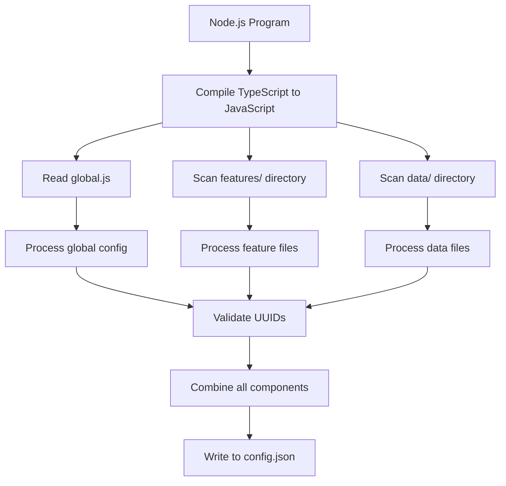

# Mockoon Config Generator - Implementation Plan

## Project Overview

We'll create a Node.js program that:

1. Reads TypeScript configuration files from a specific directory structure
2. Compiles TypeScript files to JavaScript using the TypeScript compiler
3. Combines the configurations into a single Mockoon configuration file
4. Validates that all required UUIDs are provided by the user
5. Maps the directory structure to the Mockoon folder structure

## Directory Structure

```
configs/
  global.ts             # Environment-level settings
  features/
    feature-name/       # Each subdirectory becomes a folder in Mockoon
      endpoint-name.ts  # Each file becomes a route within that folder
  data/
    data-name.ts        # Each file becomes a databucket entry
  config.json           # The final generated file
```

## System Architecture



## Implementation Plan

### 1. Project Setup

- Create a new Node.js project
- Install necessary dependencies:
  - TypeScript
  - fs-extra (for enhanced file system operations)
  - glob (for file pattern matching)

### 2. TypeScript Compilation

- Create a function to compile TypeScript files to JavaScript
- Use TypeScript's programmatic API to respect project configuration
- Output compiled JavaScript to a temporary directory

```typescript
import * as ts from "typescript";
import * as path from "path";
import * as fs from "fs-extra";

async function compileTypeScript(configDir: string): Promise<string> {
  // Read tsconfig.json if it exists, or use default options
  let compilerOptions: ts.CompilerOptions = {
    target: ts.ScriptTarget.ES2020,
    module: ts.ModuleKind.CommonJS,
    esModuleInterop: true,
    outDir: path.join(configDir, ".tmp"),
  };

  const tsconfigPath = path.join(configDir, "tsconfig.json");
  if (fs.existsSync(tsconfigPath)) {
    const tsconfig = require(tsconfigPath);
    compilerOptions = { ...compilerOptions, ...tsconfig.compilerOptions };
  }

  // Create program
  const program = ts.createProgram(
    glob.sync(path.join(configDir, "**/*.ts")),
    compilerOptions
  );

  // Emit output
  const emitResult = program.emit();

  // Report any errors
  const allDiagnostics = ts
    .getPreEmitDiagnostics(program)
    .concat(emitResult.diagnostics);
  if (allDiagnostics.length > 0) {
    allDiagnostics.forEach((diagnostic) => {
      const message = ts.flattenDiagnosticMessageText(
        diagnostic.messageText,
        "\n"
      );
      if (diagnostic.file) {
        const { line, character } =
          diagnostic.file.getLineAndCharacterOfPosition(diagnostic.start!);
        console.error(
          `${diagnostic.file.fileName} (${line + 1},${
            character + 1
          }): ${message}`
        );
      } else {
        console.error(message);
      }
    });
    throw new Error("TypeScript compilation failed");
  }

  return compilerOptions.outDir!;
}
```

### 3. UUID Validation

- Create a function to validate that all required UUIDs are provided
- Throw clear error messages if any UUIDs are missing

```typescript
function validateUUID(obj: any, path: string): void {
  if (!obj.uuid) {
    throw new Error(`Missing UUID in ${path}`);
  }

  // Validate UUIDs in nested objects
  if (Array.isArray(obj)) {
    obj.forEach((item, index) => {
      validateUUID(item, `${path}[${index}]`);
    });
  } else if (typeof obj === "object" && obj !== null) {
    for (const key in obj) {
      if (key === "responses" || key === "children" || key === "data") {
        validateUUID(obj[key], `${path}.${key}`);
      }
    }
  }
}
```

### 4. Config File Processing

- Create functions to process different types of config files:
  - Process global.js to extract environment-level settings
  - Process feature files to create routes
  - Process data files to create databuckets

````typescript
import * as fs from "fs-extra";
import * as path from "path";

async function processGlobalConfig(compiledDir: string): Promise<any> {
  const globalPath = path.join(compiledDir, "global.js");

  // Check if global.js exists
  if (!fs.existsSync(globalPath)) {
    throw new Error("global.js not found");
  }

  // Load the global config
  const globalConfig = require(globalPath).default || require(globalPath);

  // Validate that UUID is provided
  if (!globalConfig.uuid) {
    throw new Error("Missing UUID in global config");
  }

  return globalConfig;
}

async function processFeatures(
  compiledDir: string
): Promise<{ folders: any[]; routes: any[] }> {
  const featuresDir = path.join(compiledDir, "features");
  const folders: any[] = [];
  const routes: any[] = [];

  // Check if features directory exists
  if (!fs.existsSync(featuresDir)) {
    return { folders, routes };
  }

  // Get all subdirectories in the features directory
  const featureDirs = fs
    .readdirSync(featuresDir)
    .filter((item) => fs.statSync(path.join(featuresDir, item)).isDirectory());

  // Process each feature directory
  for (const featureDir of featureDirs) {
    const featurePath = path.join(featuresDir, featureDir);

    // Create folder object
    const folderConfigPath = path.join(featurePath, "folder.js");
    let folder: any;

    if (fs.existsSync(folderConfigPath)) {
      // If folder.js exists, use it for folder configuration
      folder = require(folderConfigPath).default || require(folderConfigPath);
    } else {
      // Otherwise, create a basic folder object with the directory name
      folder = {
        name: featureDir
          .replace(/-/g, " ")
          .replace(/\b\w/g, (l) => l.toUpperCase()), // Convert kebab-case to Title Case
        children: [],
      };
    }

    // Validate that folder UUID is provided
    if (!folder.uuid) {
      throw new Error(`Missing UUID in folder config for ${featureDir}`);
    }

    // Get all JavaScript files in the feature directory (excluding folder.js)
    const featureFiles = fs
      .readdirSync(featurePath)
      .filter((file) => file.endsWith(".js") && file !== "folder.js");

    // Process each feature file
    for (const featureFile of featureFiles) {
      const filePath = path.join(featurePath, featureFile);

      // Load the route configuration
      const routeConfig = require(filePath).default || require(filePath);

      // Validate that route UUID is provided
      if (!routeConfig.uuid) {
        throw new Error(
          `Missing UUID in route config for ${featureDir}/${featureFile}`
        );
      }

      // Validate that all responses have UUIDs
      if (routeConfig.responses) {
        for (const response of routeConfig.responses) {
          if (!response.uuid) {
            throw new Error(
              `Missing UUID in response for route ${featureDir}/${featureFile}`
            );
          }
        }
      }

      // Add route reference to folder's children
      folder.children.push({
        type: "route",
        uuid: routeConfig.uuid,
      });

      // Add route to routes array
      routes.push(routeConfig);
    }

    // Add folder to folders array
    folders.push(folder);
  }

  return { folders, routes };
}

async function processData(compiledDir: string): Promise<any[]> {
  const dataDir = path.join(compiledDir, "data");
  const databuckets: any[] = [];

  // Check if data directory exists
  if (!fs.existsSync(dataDir)) {
    return databuckets;
  }

  // Get all JavaScript files in the data directory
  const dataFiles = fs
    .readdirSync(dataDir)
    .filter((file) => file.endsWith(".js"));

  // Process each data file
  for (const dataFile of dataFiles) {
    const filePath = path.join(dataDir, dataFile);

    // Load the databucket configuration
    const databucketConfig = require(filePath).default || require(filePath);

    // Validate that databucket UUID is provided
    if (!databucketConfig.uuid) {
      throw new Error(`Missing UUID in databucket config for ${dataFile}`);
    }

    // Add databucket to databuckets array
    databuckets.push(databucketConfig);
  }

  return databuckets;
}
### 5. Config Generation

- Create a function to combine all processed components into a single Mockoon config
- Ensure all references between components (like folder UUIDs in routes) are correctly set

```typescript
function generateConfig(globalConfig: any, folders: any[], routes: any[], databuckets: any[]): any {
  // Create root children array (references to top-level folders)
  const rootChildren = folders.map(folder => ({
    type: 'folder',
    uuid: folder.uuid
  }));

  // Combine all components into the final config
  const config = {
    ...globalConfig,
    folders,
    routes,
    data: databuckets,
    rootChildren
  };

  return config;
}
````

### 6. Main Program Flow

- Create the main program flow that orchestrates all the above components
- Handle error cases and provide useful error messages

```typescript
import * as fs from "fs-extra";
import * as path from "path";

async function main(configDir: string, outputPath: string): Promise<void> {
  try {
    // Compile TypeScript to JavaScript
    console.log("Compiling TypeScript files...");
    const compiledDir = await compileTypeScript(configDir);

    // Process global config
    console.log("Processing global config...");
    const globalConfig = await processGlobalConfig(compiledDir);

    // Process features
    console.log("Processing features...");
    const { folders, routes } = await processFeatures(compiledDir);

    // Process data
    console.log("Processing data...");
    const databuckets = await processData(compiledDir);

    // Generate the final config
    console.log("Generating final config...");
    const config = generateConfig(globalConfig, folders, routes, databuckets);

    // Write the config to the output file
    console.log(`Writing config to ${outputPath}...`);
    await fs.writeJson(outputPath, config, { spaces: 2 });

    // Clean up temporary directory
    console.log("Cleaning up...");
    await fs.remove(compiledDir);

    console.log(`Mockoon config generated successfully: ${outputPath}`);
  } catch (error) {
    console.error("Error generating Mockoon config:", error);
    process.exit(1);
  }
}

// Parse command line arguments
const configDir = process.argv[2] || "./configs";
const outputPath = process.argv[3] || "./configs/config.json";

// Run the program
main(configDir, outputPath);
```

```

```

### 7. CLI Interface

- Create a command-line interface for the program
- Allow users to specify input and output directories

```typescript
#!/usr/bin/env node
import * as yargs from "yargs";
import { hideBin } from "yargs/helpers";
import { main } from "./main";

yargs(hideBin(process.argv))
  .command(
    "generate [configDir] [outputPath]",
    "Generate Mockoon config",
    (yargs) => {
      return yargs
        .positional("configDir", {
          describe: "Directory containing config files",
          default: "./configs",
        })
        .positional("outputPath", {
          describe: "Output path for the generated config",
          default: "./configs/config.json",
        });
    },
    (argv) => {
      main(argv.configDir as string, argv.outputPath as string);
    }
  )
  .demandCommand(1, "You need at least one command")
  .help().argv;
```

## File Structure for the Node.js Program

```
src/
  index.ts                # Main entry point and CLI interface
  compiler.ts             # TypeScript compilation utilities
  validators.ts           # UUID validation utilities
  processors/
    global-processor.ts   # Process global.js
    feature-processor.ts  # Process feature files
    data-processor.ts     # Process data files
  generators/
    config-generator.ts   # Generate the final config
  main.ts                 # Main program flow
```

## Example Configuration Files

### global.ts

```typescript
export default {
  uuid: "133659f5-634e-4385-bf7c-0279f626d386",
  lastMigration: 33,
  name: "My API",
  endpointPrefix: "",
  latency: 0,
  port: 3001,
  hostname: "",
  proxyMode: false,
  proxyHost: "",
  proxyRemovePrefix: false,
  cors: true,
  headers: [
    {
      key: "Content-Type",
      value: "application/json",
    },
  ],
};
```

### features/transaction-instalments/folder.ts

```typescript
export default {
  uuid: "184807bf-4acd-4891-bada-4b47a5d8f560",
  name: "Transaction Instalments",
  children: [], // This will be populated by the program
};
```

### features/transaction-instalments/get-eligibility.ts

```typescript
export default {
  uuid: "e17b35bc-24b7-4e6e-a4d9-a08278d7bd98",
  type: "http",
  documentation: "Get Eligibility",
  method: "get",
  endpoint: "credit/1.0/underwriting/transactioninstalment/user",
  responses: [
    {
      uuid: "5440c285-3482-48a3-b266-32b03ab5f269",
      body: "{}",
      latency: 1000,
      statusCode: 404,
      label: "",
      headers: [],
      bodyType: "INLINE",
      filePath: "",
      databucketID: "",
      sendFileAsBody: false,
      rules: [],
      rulesOperator: "OR",
      disableTemplating: false,
      fallbackTo404: false,
      default: false,
    },
    {
      uuid: "31bfc3f2-b8bb-4dd5-9beb-9af39dcf3437",
      body: JSON.stringify(
        {
          max_loan_amount: "$5000.00",
          min_loan_amount: "$100.00",
          fees: [
            {
              duration: 3,
              percentage: 15,
              amount: "$11.25",
              name: "3-month instalment fee",
            },
          ],
          interest_rate: 15,
          eligibility_result: "ELIGIBLE",
        },
        null,
        2
      ),
      latency: 0,
      statusCode: 200,
      label: "ELIGIBLE",
      headers: [],
      bodyType: "INLINE",
      filePath: "",
      databucketID: "",
      sendFileAsBody: false,
      rules: [],
      rulesOperator: "OR",
      disableTemplating: false,
      fallbackTo404: false,
      default: true,
    },
  ],
};
```

### data/user.ts

```typescript
export default {
  uuid: "91062199-b9b6-48a4-80c2-dcf5f6287d80",
  id: "users",
  name: "Users",
  documentation: "",
  value: `[
  {{#repeat 50}}
  {
    "id": "{{faker 'string.uuid'}}",
    "username": "{{faker 'internet.userName'}}"
  }
  {{/repeat}}
]`,
};
```
