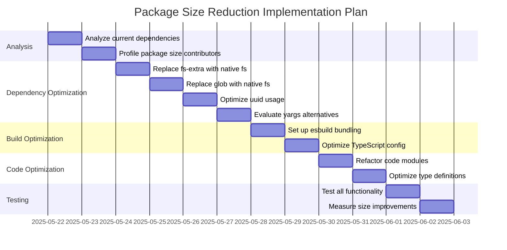

# Package Size Reduction Plan for mockoon-config-generator

## Current State Analysis

- Package size: 54.9kb unpacked
- Main functionality: Generate Mockoon configuration files from TypeScript files
- Key dependencies: fs-extra, glob, typescript, uuid, yargs
- TypeScript configuration: Generates declaration files and maps

## Size Reduction Strategies

### 1. Dependency Optimization

#### 1.1 Evaluate and Replace Heavy Dependencies

- **fs-extra** (11.1.1): Consider replacing with native Node.js fs/promises API
- **glob** (10.3.3): Consider using native Node.js fs.readdir with filtering
- **uuid** (11.1.0): Consider using a smaller UUID implementation or crypto.randomUUID()
- **yargs** (17.7.2): Consider using a lighter CLI argument parser or native process.argv

#### 1.2 Move TypeScript to a Peer Dependency

- Since TypeScript is used for compilation, it could be moved to a peer dependency
- This would reduce the installation size while still allowing the tool to function

### 2. Build and Packaging Optimization

#### 2.1 Bundle the Code

- Use a bundler like esbuild to create a single optimized JavaScript file
- This would eliminate duplicate code and reduce the overall package size
- Configure the bundler to tree-shake unused code

#### 2.2 Optimize TypeScript Configuration

- Review declaration map generation (declarationMap in tsconfig.json)
- Consider if source maps are necessary for the published package

#### 2.3 Refine Package Files

- Review the "files" field in package.json to ensure only necessary files are included
- Consider excluding test files, examples, and documentation from the published package

### 3. Code Optimization

#### 3.1 Refactor Code for Size

- Combine smaller modules where appropriate
- Remove any unused code or functions
- Optimize imports to only import what's needed

#### 3.2 Optimize Type Definitions

- Review if all type definitions are necessary
- Consider if some types can be simplified or combined

### 4. Implementation Plan

## Detailed Implementation Steps

### Step 1: Replace fs-extra with native fs/promises

- Identify all fs-extra usage in the codebase
- Replace with equivalent Node.js fs/promises API calls
- Test to ensure functionality is maintained

### Step 2: Replace glob with native fs.readdir

- Implement a recursive directory scanning function using fs.readdir
- Replace glob usage with this custom implementation
- Test to ensure pattern matching still works correctly

### Step 3: Optimize UUID generation

- Replace uuid library with Node.js crypto.randomUUID() (if Node.js 14+ is targeted)
- Or implement a smaller UUID generator function

### Step 4: Evaluate yargs alternatives

- Consider replacing with a lighter CLI parser or custom argument parsing
- Test to ensure all command-line options still work

### Step 5: Set up esbuild bundling

- Install esbuild as a dev dependency
- Configure esbuild to bundle the code into a single file
- Update package.json scripts to use esbuild for building

### Step 6: Optimize TypeScript configuration

- Review and adjust tsconfig.json settings
- Consider removing declarationMap if not necessary
- Ensure only necessary declaration files are generated

### Step 7: Refactor code modules

- Identify opportunities to combine smaller modules
- Remove any unused code or functions
- Optimize imports to only import what's needed

### Step 8: Test and measure

- Test all functionality to ensure it still works as expected
- Measure the size improvement after all optimizations

## Expected Outcomes

- Reduced published package size
- Reduced installation size (including dependencies)
- Maintained functionality and TypeScript type definitions
- Potentially improved performance due to optimized code
